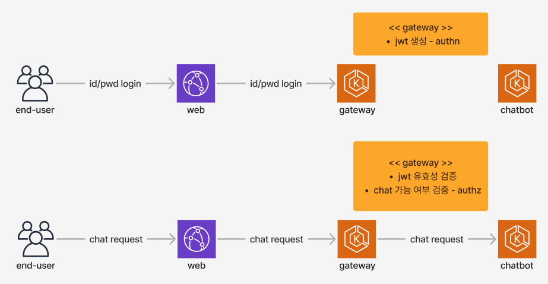
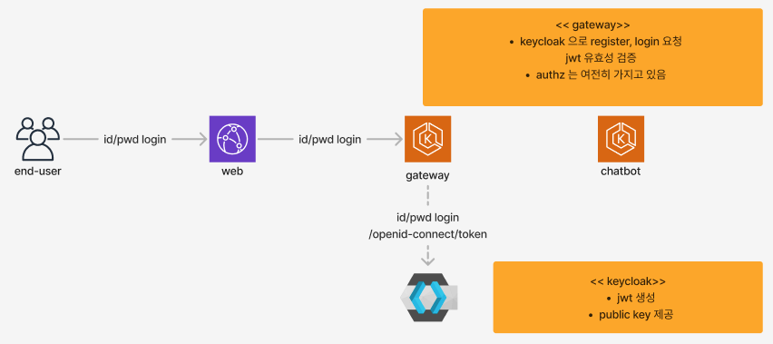

# townhall

## background



- gw 는 이름과 달리 여러가지 기능이 모여있는 모놀리식 서버이며 담당 개발자 1명이 개발하고 있습니다.
- gw 는 authn, authz 를 모두 하고 있습니다.
- 회원에 관련된 개발 요건이 백로그에 쌓이고 있으며, 요건 중에는 보안 요소도 있습니다.
- gw 의 부담을 줄이기 위해 회원에 관련된 기능을 분리하고 싶습니다.

## set up

### postgres(15432), keycloak(18080) 기동

```shell
$ cd docker
$ docker-compose up -d
```

## phase 1



### keycloak 사전 준비

1. `client-user` realm 생성
2. 이메일 로그인 세팅
    - Realm Settings > Login
        - Email as username: ON
3. user attributes 세팅
    - Realm Settings > User profile
        - attributes 삭제: First Name, Last Name
        - attributes 추가: name
4. gateway 에서 사용할 client 생성
    - Clients > Create
        - Client ID: `gateway-service`
        - Client authentication: ON
        - Authentication Flow Overrides: Standard flow, Direct access grants, Service account roles

### keycloak api 사용법

> /http-client/keycloak

- [x] 01_user_register.http
- [x] 02_user_login.http
- [x] 03_user_pwd_reset.http
- [x] 04_access_key_verify_by_public_key.http
- [x] 05_access_token_from_refresh_token.http

## phase 2

### keycloak 사전 준비

1. `client-user` realm 선택
2. townhall 에서 사용할 client 생성
   - Clients > Create
      - Client ID: `townhall`
      - Client authentication: ON
      - Authentication Flow Overrides: Standard flow, Direct access grants, Service account roles
3. logging enabled
   - Realm Settings > Events > User events settings
      - Save events: ON
      - Expire events: 30 days
